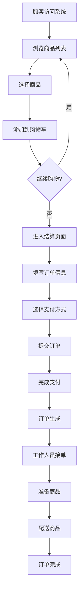
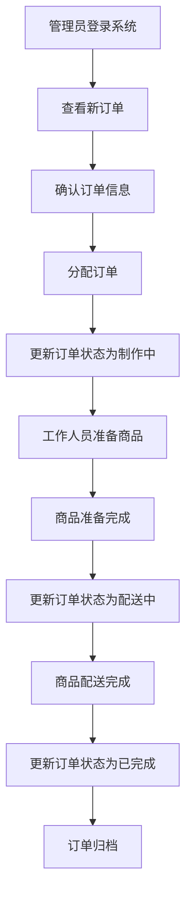
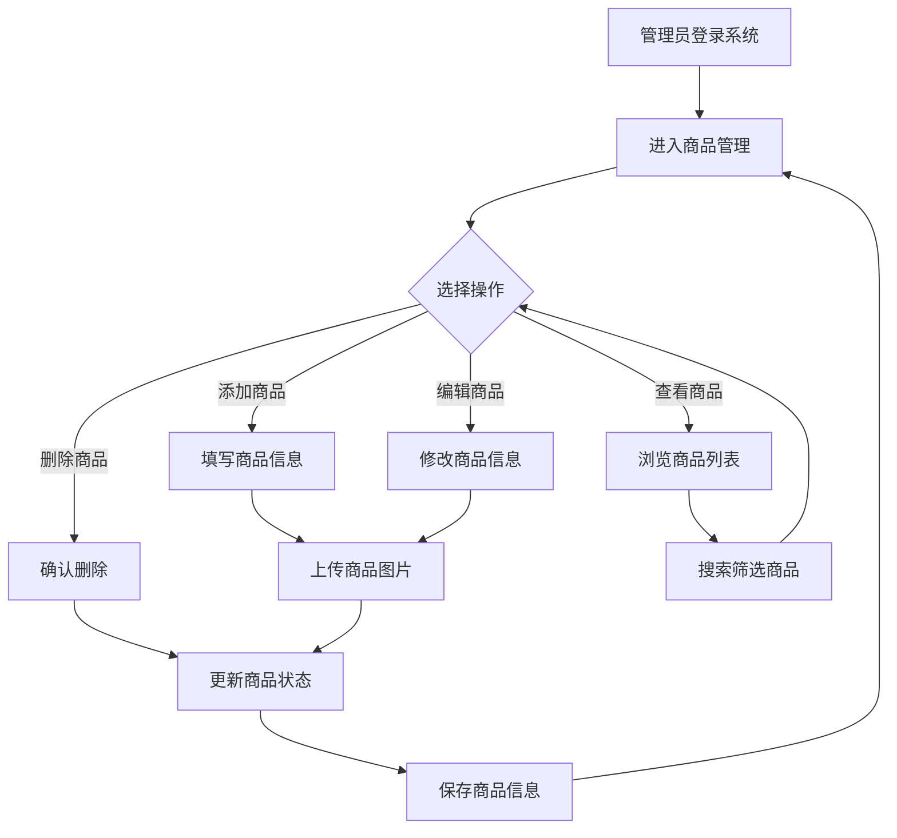

# 网吧点餐系统需求文档

## 1. 文档概述

### 1.1 文档目的
本需求文档详细描述了网吧点餐系统的功能需求、非功能需求、业务流程和技术要求，为系统设计、开发和测试提供依据。

### 1.2 文档范围
本文档涵盖了网吧点餐系统的所有功能模块，包括商品管理、订单管理、用户管理、支付管理和报表统计等。

### 1.3 术语定义
| 术语 | 解释 |
|-----|-----|
| 顾客 | 使用网吧服务并通过系统点餐的用户 |
| 管理员 | 负责管理系统和处理订单的工作人员 |
| 商品 | 网吧提供的可销售物品，如饮料、零食、餐品等 |
| 分类 | 商品的类别划分，如饮料、零食、快餐等 |
| 订单 | 顾客购买商品的请求记录 |
| 购物车 | 顾客临时存放待购买商品的虚拟容器 |
| 桌号 | 顾客在网吧的座位编号，用于订单配送 |

## 2. 业务需求

### 2.1 业务背景
随着网吧行业的发展，顾客对服务质量的要求越来越高。传统的人工点餐方式效率低下，容易出错，且无法满足顾客的个性化需求。因此，开发一套高效、便捷的网吧点餐系统势在必行。

### 2.2 业务目标
- 提高点餐效率，减少人工成本
- 提升顾客体验，增加顾客满意度
- 实现商品和库存的精细化管理
- 提供准确的销售数据和报表
- 支持多种支付方式，方便顾客支付

### 2.3 业务流程

#### 2.3.1 顾客点餐流程
1. 顾客访问系统，浏览商品列表
2. 顾客选择商品，添加到购物车
3. 顾客确认购物车，填写订单信息（桌号、备注等）
4. 顾客选择支付方式，完成支付
5. 系统生成订单，通知厨房/吧台
6. 工作人员准备商品，配送至顾客座位
7. 订单完成

#### 2.3.2 管理员管理流程
1. 管理员登录系统
2. 管理员管理商品信息（添加、编辑、删除商品）
3. 管理员管理订单（查看、处理、取消订单）
4. 管理员管理用户信息（添加、编辑、删除用户）
5. 管理员查看报表统计（销售数据、商品排行等）
6. 管理员退出系统

## 3. 功能需求

### 3.1 系统管理

#### 3.1.1 登录功能
- 支持管理员和顾客登录
- 支持密码找回功能
- 支持记住密码功能
- 登录失败次数限制（连续5次失败，账号锁定30分钟）

#### 3.1.2 权限管理
- 基于角色的权限控制（RBAC）
- 支持多级管理员权限
- 支持功能权限和数据权限控制

### 3.2 商品管理

#### 3.2.1 商品分类管理
- 支持添加、编辑、删除商品分类
- 支持分类排序
- 支持分类搜索
- 支持查看分类下的商品数量

#### 3.2.2 商品信息管理
- 支持添加、编辑、删除商品
- 支持商品图片上传
- 支持商品价格管理
- 支持商品库存管理
- 支持商品状态管理（上架/下架）
- 支持商品搜索和筛选
- 支持商品批量操作

#### 3.2.3 商品属性管理
- 支持商品规格管理（如大小、口味等）
- 支持商品标签管理
- 支持商品推荐设置

### 3.3 订单管理

#### 3.3.1 订单创建
- 支持顾客自主创建订单
- 支持管理员代客创建订单
- 支持订单备注功能
- 支持桌号关联功能

#### 3.3.2 订单处理
- 支持订单状态管理（待支付、已支付、制作中、已完成、已取消）
- 支持订单优先级设置
- 支持订单分配功能
- 支持订单备注修改

#### 3.3.3 订单查询
- 支持按订单号查询
- 支持按顾客查询
- 支持按时间范围查询
- 支持按订单状态查询
- 支持按支付方式查询
- 支持订单导出功能

#### 3.3.4 订单打印
- 支持订单自动打印
- 支持手动打印订单
- 支持自定义打印模板

### 3.4 购物车管理

- 支持添加商品到购物车
- 支持修改购物车商品数量
- 支持删除购物车商品
- 支持清空购物车
- 支持购物车商品总价计算
- 支持购物车数据持久化

### 3.5 支付管理

#### 3.5.1 支付方式
- 支持现金支付
- 支持扫码支付（微信、支付宝）
- 支持会员卡支付

#### 3.5.2 支付流程
- 支持在线支付
- 支持线下支付确认
- 支持支付状态同步
- 支持支付记录查询

### 3.6 用户管理

#### 3.6.1 顾客管理
- 支持顾客注册
- 支持顾客信息修改
- 支持顾客密码修改
- 支持顾客积分管理
- 支持顾客消费记录查询

#### 3.6.2 管理员管理
- 支持管理员添加、编辑、删除
- 支持管理员密码重置
- 支持管理员权限分配
- 支持管理员操作日志记录

### 3.7 报表统计

#### 3.7.1 销售报表
- 支持日销售报表
- 支持周销售报表
- 支持月销售报表
- 支持年销售报表
- 支持销售趋势分析

#### 3.7.2 商品报表
- 支持商品销售排行
- 支持商品库存预警
- 支持商品销售明细查询

#### 3.7.3 营业报表
- 支持营业收入统计
- 支持订单数量统计
- 支持客单价统计
- 支持支付方式占比分析

### 3.8 通知管理

- 支持订单状态变更通知
- 支持新订单提醒
- 支持库存预警通知
- 支持系统消息通知

## 4. 非功能需求

### 4.1 性能需求
- 页面响应时间：≤2秒
- 订单处理时间：≤1秒/单
- 并发用户数：支持500并发
- 系统可用性：≥99.5%
- 数据备份时间：≤30分钟

### 4.2 安全需求
- 数据加密：密码使用bcrypt加密存储，敏感数据传输使用HTTPS
- 防止SQL注入：所有数据库操作使用参数化查询
- 防止XSS攻击：所有用户输入进行过滤和转义
- 防止CSRF攻击：使用CSRF令牌验证
- 日志记录：所有关键操作记录日志
- 定期安全审计：每月进行一次安全审计

### 4.3 兼容性需求
- 浏览器兼容：支持Chrome 120+、Firefox 115+、Safari 17+、Edge 120+
- 设备兼容：支持桌面端、平板设备、移动设备
- 分辨率兼容：支持1024×768及以上分辨率

### 4.4 易用性需求
- 界面设计简洁直观，符合用户习惯
- 操作流程简单，减少用户学习成本
- 错误提示清晰明确，指导用户纠正错误
- 支持键盘快捷键操作
- 支持响应式设计，适配不同屏幕尺寸

### 4.5 可扩展性需求
- 支持模块化设计，便于功能扩展
- 支持第三方系统集成
- 支持插件机制，便于功能定制
- 支持API接口，便于二次开发

## 5. 数据需求

### 5.1 数据模型

#### 5.1.1 商品分类表（categories）
| 字段名 | 数据类型 | 约束 | 描述 |
|-------|---------|------|------|
| id | INTEGER | PRIMARY KEY AUTOINCREMENT | 分类ID |
| name | VARCHAR(50) | NOT NULL UNIQUE | 分类名称 |
| description | TEXT | | 分类描述 |
| sort_order | INTEGER | DEFAULT 0 | 排序顺序 |
| is_active | BOOLEAN | DEFAULT 1 | 是否激活 |
| created_at | DATETIME | DEFAULT CURRENT_TIMESTAMP | 创建时间 |
| updated_at | DATETIME | DEFAULT CURRENT_TIMESTAMP | 更新时间 |

#### 5.1.2 商品表（products）
| 字段名 | 数据类型 | 约束 | 描述 |
|-------|---------|------|------|
| id | INTEGER | PRIMARY KEY AUTOINCREMENT | 商品ID |
| category_id | INTEGER | NOT NULL REFERENCES categories(id) | 分类ID |
| name | VARCHAR(100) | NOT NULL UNIQUE | 商品名称 |
| description | TEXT | | 商品描述 |
| price | DECIMAL(10,2) | NOT NULL | 商品价格 |
| stock | INTEGER | NOT NULL DEFAULT 0 | 库存数量 |
| image | VARCHAR(255) | | 商品图片路径 |
| is_available | BOOLEAN | NOT NULL DEFAULT 1 | 是否可售 |
| sort_order | INTEGER | DEFAULT 0 | 排序顺序 |
| created_at | DATETIME | DEFAULT CURRENT_TIMESTAMP | 创建时间 |
| updated_at | DATETIME | DEFAULT CURRENT_TIMESTAMP | 更新时间 |

#### 5.1.3 用户表（users）
| 字段名 | 数据类型 | 约束 | 描述 |
|-------|---------|------|------|
| id | INTEGER | PRIMARY KEY AUTOINCREMENT | 用户ID |
| username | VARCHAR(50) | NOT NULL UNIQUE | 用户名 |
| password | VARCHAR(255) | NOT NULL | 密码（加密存储） |
| role | VARCHAR(20) | NOT NULL DEFAULT 'customer' | 角色（customer/admin） |
| nickname | VARCHAR(50) | | 用户昵称 |
| phone | VARCHAR(20) | | 手机号码 |
| email | VARCHAR(100) | | 邮箱地址 |
| points | INTEGER | DEFAULT 0 | 积分 |
| is_active | BOOLEAN | DEFAULT 1 | 是否激活 |
| last_login_at | DATETIME | | 最后登录时间 |
| created_at | DATETIME | DEFAULT CURRENT_TIMESTAMP | 创建时间 |
| updated_at | DATETIME | DEFAULT CURRENT_TIMESTAMP | 更新时间 |

#### 5.1.4 订单表（orders）
| 字段名 | 数据类型 | 约束 | 描述 |
|-------|---------|------|------|
| id | INTEGER | PRIMARY KEY AUTOINCREMENT | 订单ID |
| order_no | VARCHAR(50) | NOT NULL UNIQUE | 订单编号 |
| user_id | INTEGER | NOT NULL REFERENCES users(id) | 用户ID |
| total_amount | DECIMAL(10,2) | NOT NULL | 订单总金额 |
| status | VARCHAR(20) | NOT NULL DEFAULT 'pending' | 订单状态 |
| payment_method | VARCHAR(20) | | 支付方式 |
| payment_status | VARCHAR(20) | NOT NULL DEFAULT 'unpaid' | 支付状态 |
| table_number | VARCHAR(20) | | 桌号/机器号 |
| notes | TEXT | | 备注信息 |
| created_by | VARCHAR(50) | | 创建人 |
| processed_by | VARCHAR(50) | | 处理人 |
| created_at | DATETIME | DEFAULT CURRENT_TIMESTAMP | 创建时间 |
| updated_at | DATETIME | DEFAULT CURRENT_TIMESTAMP | 更新时间 |

#### 5.1.5 订单明细表（order_items）
| 字段名 | 数据类型 | 约束 | 描述 |
|-------|---------|------|------|
| id | INTEGER | PRIMARY KEY AUTOINCREMENT | 明细ID |
| order_id | INTEGER | NOT NULL REFERENCES orders(id) | 订单ID |
| product_id | INTEGER | NOT NULL REFERENCES products(id) | 商品ID |
| product_name | VARCHAR(100) | NOT NULL | 商品名称 |
| quantity | INTEGER | NOT NULL | 商品数量 |
| unit_price | DECIMAL(10,2) | NOT NULL | 商品单价 |
| total_price | DECIMAL(10,2) | NOT NULL | 商品总价 |
| created_at | DATETIME | DEFAULT CURRENT_TIMESTAMP | 创建时间 |

#### 5.1.6 支付记录表（payments）
| 字段名 | 数据类型 | 约束 | 描述 |
|-------|---------|------|------|
| id | INTEGER | PRIMARY KEY AUTOINCREMENT | 支付ID |
| order_id | INTEGER | NOT NULL REFERENCES orders(id) | 订单ID |
| payment_no | VARCHAR(50) | NOT NULL UNIQUE | 支付编号 |
| amount | DECIMAL(10,2) | NOT NULL | 支付金额 |
| payment_method | VARCHAR(20) | NOT NULL | 支付方式 |
| payment_status | VARCHAR(20) | NOT NULL DEFAULT 'pending' | 支付状态 |
| transaction_id | VARCHAR(100) | | 第三方交易ID |
| created_at | DATETIME | DEFAULT CURRENT_TIMESTAMP | 创建时间 |
| updated_at | DATETIME | DEFAULT CURRENT_TIMESTAMP | 更新时间 |

### 5.2 数据关系

```
┌────────────┐       ┌────────────┐       ┌────────────┐
│   商品分类  │───1:N─│    商品    │───N:1─│    订单明细 │
└────────────┘       └────────────┘       └────────────┘
                                              │
                                              │ N:1
                                              ▼
                                        ┌────────────┐       ┌────────────┐
                                        │    订单    │───1:1─│    支付记录 │
                                        └────────────┘       └────────────┘
                                              │
                                              │ N:1
                                              ▼
                                        ┌────────────┐
                                        │    用户    │
                                        └────────────┘
```

## 6. 业务流程

### 6.1 顾客点餐流程



### 6.2 管理员处理订单流程



### 6.3 商品管理流程



## 7. 技术要求

### 7.1 技术栈

| 分类 | 技术 | 版本 |
|-----|-----|-----|
| 后端框架 | Flask | 2.0+ |
| 前端框架 | Bootstrap | 5.0+ |
| 数据库 | SQLite（开发）/ MySQL（生产） | 3.0+/8.0+ |
| 开发语言 | Python | 3.8+ |
| 模板引擎 | Jinja2 | 3.0+ |
| CSS框架 | Bootstrap | 5.0+ |
| JavaScript | jQuery | 3.6+ |
| ORM | SQLAlchemy | 2.0+ |
| 认证 | Flask-Login | 0.6+ |
| 表单验证 | Flask-WTF | 1.1+ |
| 文件上传 | Flask-Uploads | 0.2.1+ |

### 7.2 系统架构

- **架构模式**：MVC（Model-View-Controller）
- **部署方式**：B/S（Browser/Server）
- **服务器要求**：
  - CPU：2核及以上
  - 内存：4GB及以上
  - 硬盘：100GB及以上
  - 操作系统：Linux/Unix
  - 网络：稳定的网络连接

### 7.3 接口要求

- **RESTful API**：提供标准化的RESTful API接口
- **API文档**：使用Swagger或Postman生成API文档
- **接口安全**：使用JWT或Session进行身份验证
- **接口版本**：支持API版本控制

### 7.4 数据库要求

- **数据库设计**：符合第三范式
- **数据备份**：支持自动备份和手动备份
- **数据恢复**：支持数据恢复功能
- **性能优化**：支持索引优化和查询优化

## 8. 系统界面设计

### 8.1 设计原则
- 简洁明了，易于操作
- 美观大方，符合现代设计风格
- 响应式设计，适配不同设备
- 一致性设计，保持界面风格统一
- 无障碍设计，支持键盘导航和屏幕阅读器

### 8.2 主要界面

#### 8.2.1 顾客端界面
- 首页：商品分类和推荐商品
- 商品列表页：按分类展示商品
- 商品详情页：商品详细信息和购买选项
- 购物车页：购物车商品管理
- 结算页：订单信息填写和支付
- 订单列表页：顾客订单查询
- 订单详情页：订单详细信息
- 个人中心：顾客信息管理

#### 8.2.2 管理员端界面
- 登录页：管理员登录
- 首页：系统概览和数据统计
- 商品管理页：商品和分类管理
- 订单管理页：订单查询和处理
- 用户管理页：用户信息管理
- 报表统计页：销售数据和报表
- 系统设置页：系统参数配置

## 9. 测试要求

### 9.1 测试类型
- 功能测试：验证系统功能是否正常
- 性能测试：测试系统在不同负载下的性能表现
- 安全测试：验证系统的安全性和防护能力
- 兼容性测试：测试系统在不同浏览器和设备上的兼容性
- 可用性测试：评估系统的易用性和用户体验

### 9.2 测试用例
- 覆盖所有功能模块
- 包含正常场景和异常场景
- 包含边界条件测试
- 包含并发测试

### 9.3 测试环境
- 开发环境：用于开发和单元测试
- 测试环境：用于集成测试和系统测试
- 生产环境：用于验收测试和上线运行

## 10. 上线要求

### 10.1 上线前准备
- 系统测试完成，所有功能正常
- 数据迁移完成，历史数据导入成功
- 服务器配置完成，环境搭建成功
- 应急预案制定完成
- 人员培训完成

### 10.2 上线步骤
- 系统部署到生产服务器
- 进行上线前最后测试
- 切换域名或端口，正式上线
- 监控系统运行状态
- 处理上线后问题

### 10.3 上线后维护
- 定期备份数据
- 监控系统性能
- 修复bug和安全漏洞
- 进行系统升级和优化
- 提供技术支持

## 11. 项目管理

### 11.1 项目团队
- 项目经理：负责项目规划和协调
- 需求分析师：负责需求分析和文档编写
- 系统设计师：负责系统架构和数据库设计
- 开发工程师：负责系统开发和实现
- 测试工程师：负责系统测试和质量保证
- 运维工程师：负责系统部署和维护

### 11.2 项目计划

| 阶段 | 时间 | 主要工作 |
|-----|-----|---------|
| 需求分析 | 1周 | 需求调研、需求分析、文档编写 |
| 系统设计 | 1周 | 系统架构设计、数据库设计、接口设计 |
| 系统开发 | 4周 | 后端开发、前端开发、接口开发 |
| 系统测试 | 2周 | 单元测试、集成测试、系统测试 |
| 系统部署 | 1周 | 服务器配置、环境搭建、系统部署 |
| 上线运行 | 持续 | 系统监控、bug修复、功能优化 |

### 11.3 风险管理

| 风险类型 | 风险描述 | 应对措施 |
|---------|---------|---------|
| 需求变更 | 需求变更频繁，影响项目进度 | 建立需求变更管理流程，严格控制需求变更 |
| 技术风险 | 技术选型不当，导致系统性能问题 | 进行充分的技术调研和可行性分析 |
| 进度风险 | 项目进度延迟，无法按时交付 | 制定详细的项目计划，定期跟踪和调整 |
| 质量风险 | 系统质量不达标，存在较多bug | 加强测试管理，提高测试覆盖率 |
| 安全风险 | 系统存在安全漏洞，导致数据泄露 | 加强安全设计和测试，定期进行安全审计 |

## 12. 总结

本需求文档详细描述了网吧点餐系统的功能需求、非功能需求、业务流程和技术要求，为系统设计、开发和测试提供了明确的依据。系统将实现商品管理、订单管理、用户管理、支付管理和报表统计等核心功能，提高网吧的点餐效率和管理水平，提升顾客体验。

系统采用现代化的技术栈和架构设计，具有良好的性能、安全性和可扩展性。通过严格的测试和质量控制，确保系统能够稳定运行，满足网吧的业务需求。

本需求文档将作为系统开发的基础，在开发过程中如有需求变更，将通过正式的需求变更流程进行管理。